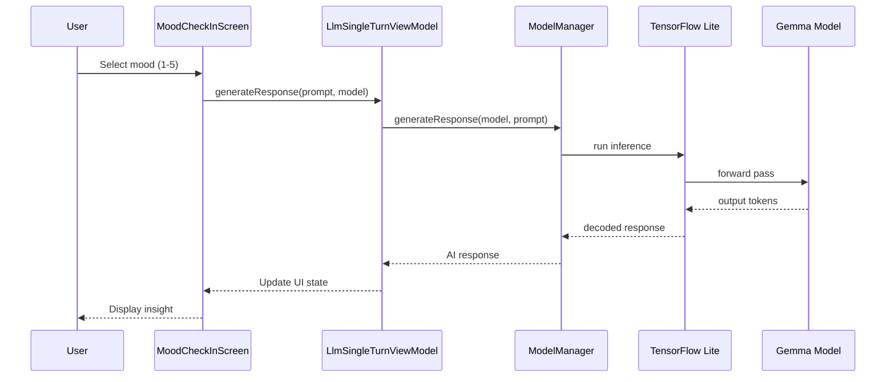
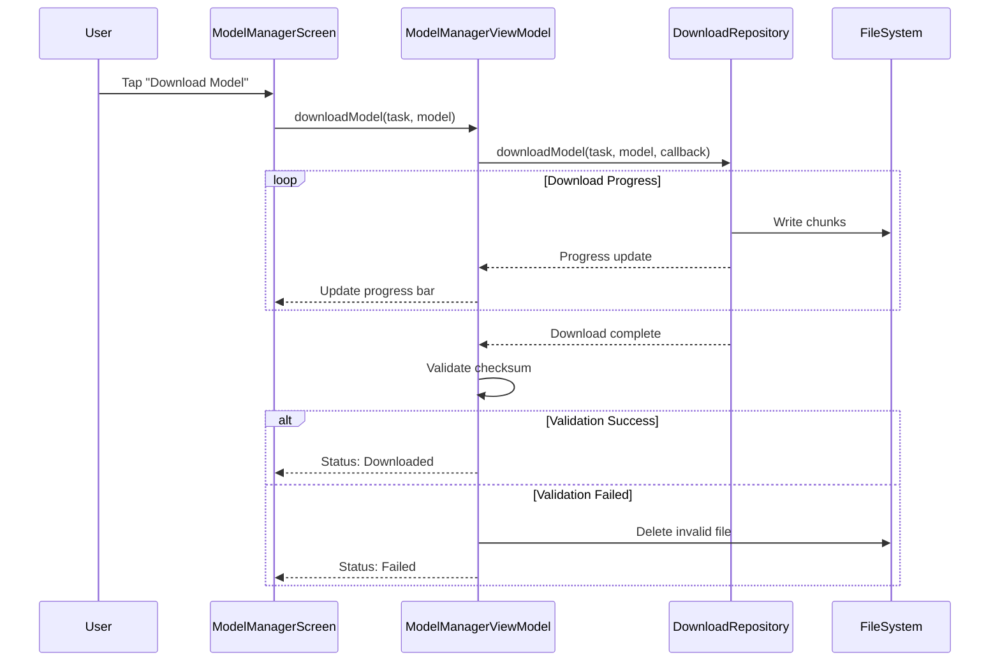
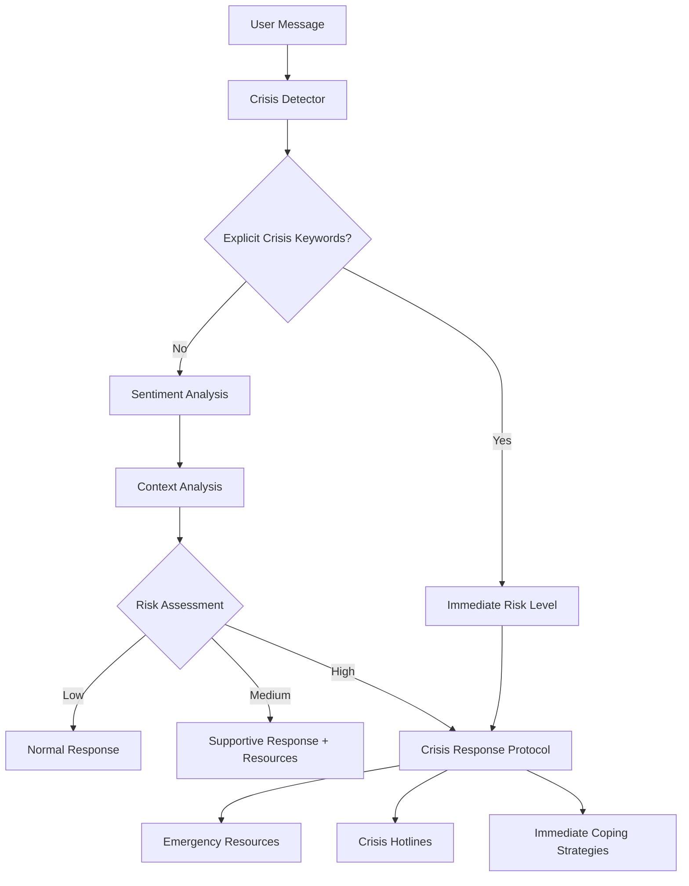

# MindMate Technical Architecture

## Table of Contents

1. [System Overview](#system-overview)
2. [Architecture Patterns](#architecture-patterns)
3. [Component Details](#component-details)
4. [Data Flow](#data-flow)
5. [Security Architecture](#security-architecture)
6. [Performance Optimization](#performance-optimization)
7. [Deployment Architecture](#deployment-architecture)

## System Overview

### High-Level Architecture

```
┌─────────────────────────────────────────────────────────────┐
│                    MindMate Application                     │
├─────────────────────────────────────────────────────────────┤
│  Presentation Layer (Jetpack Compose)                      │
│  ├── Home Screen (Glassmorphic Dashboard)                  │
│  ├── Mental Health Companion                               │
│  ├── Model Manager                                         │
│  └── Chat Interfaces                                       │
├─────────────────────────────────────────────────────────────┤
│  Business Logic Layer                                      │
│  ├── ViewModels (MVVM Pattern)                            │
│  ├── Use Cases                                            │
│  └── CustomTask System                                    │
├─────────────────────────────────────────────────────────────┤
│  Data Layer                                                │
│  ├── Repositories                                         │
│  ├── Local Storage (Room Database)                        │
│  └── Model Files (TensorFlow Lite)                        │
├─────────────────────────────────────────────────────────────┤
│  AI/ML Layer                                              │
│  ├── TensorFlow Lite Runtime                              │
│  ├── Gemma Models (2B, 7B)                               │
│  └── Model Inference Engine                               │
└─────────────────────────────────────────────────────────────┘
```

### Technology Stack

| Layer | Technology | Purpose |
|-------|------------|---------|
| **UI** | Jetpack Compose | Modern declarative UI framework |
| **Architecture** | MVVM + Clean Architecture | Separation of concerns, testability |
| **DI** | Hilt | Dependency injection and lifecycle management |
| **Database** | Room + SQLite | Local data persistence |
| **AI/ML** | TensorFlow Lite + Gemma | On-device AI inference |
| **Async** | Kotlin Coroutines + Flow | Asynchronous programming |
| **Navigation** | Compose Navigation | Type-safe navigation |
| **Security** | Android Keystore | Encryption and secure storage |

## Architecture Patterns

### 1. MVVM (Model-View-ViewModel)

```kotlin
// View (Composable)
@Composable
fun MoodCheckInScreen(
    viewModel: LlmSingleTurnViewModel = hiltViewModel(),
    modelManagerViewModel: ModelManagerViewModel = hiltViewModel()
) {
    val uiState by viewModel.uiState.collectAsState()
    
    when (uiState) {
        is LlmSingleTurnUiState.Loading -> LoadingIndicator()
        is LlmSingleTurnUiState.Success -> MoodCheckInContent(
            response = uiState.response,
            onMoodSelected = { mood -> 
                viewModel.generateResponse(
                    prompt = MentalHealthPrompts.getMoodCheckInPrompt(mood),
                    model = selectedModel
                )
            }
        )
        is LlmSingleTurnUiState.Error -> ErrorMessage(uiState.message)
    }
}

// ViewModel
@HiltViewModel
class LlmSingleTurnViewModel @Inject constructor(
    private val modelManager: ModelManager
) : ViewModel() {
    private val _uiState = MutableStateFlow<LlmSingleTurnUiState>(Initial)
    val uiState: StateFlow<LlmSingleTurnUiState> = _uiState.asStateFlow()
    
    fun generateResponse(prompt: String, model: Model) {
        viewModelScope.launch {
            _uiState.value = Loading
            try {
                val response = modelManager.generateResponse(model, prompt)
                _uiState.value = Success(response)
            } catch (e: Exception) {
                _uiState.value = Error(e.message ?: "Unknown error")
            }
        }
    }
}
```

### 2. Clean Architecture Layers

```
┌─────────────────────────────────────────┐
│         Presentation Layer              │
│  (Composables, ViewModels, UI State)   │
├─────────────────────────────────────────┤
│          Domain Layer                   │
│     (Use Cases, Business Logic)         │
├─────────────────────────────────────────┤
│           Data Layer                    │
│  (Repositories, Data Sources, Models)   │
└─────────────────────────────────────────┘
```

**Dependency Rule**: Inner layers don't depend on outer layers

```kotlin
// Domain Layer - Use Case
class GenerateMoodInsightUseCase @Inject constructor(
    private val aiRepository: AiRepository,
    private val moodRepository: MoodRepository
) {
    suspend operator fun invoke(mood: Mood): Result<MoodInsight> {
        return try {
            val history = moodRepository.getMoodHistory().first()
            val context = buildMoodContext(mood, history)
            val insight = aiRepository.generateInsight(context)
            Result.success(insight)
        } catch (e: Exception) {
            Result.failure(e)
        }
    }
}

// Data Layer - Repository Implementation
@Singleton
class AiRepositoryImpl @Inject constructor(
    private val modelManager: ModelManager,
    private val promptBuilder: PromptBuilder
) : AiRepository {
    override suspend fun generateInsight(context: MoodContext): MoodInsight {
        val prompt = promptBuilder.buildMoodInsightPrompt(context)
        val response = modelManager.generateResponse(prompt)
        return parseMoodInsight(response)
    }
}
```

### 3. CustomTask Plugin Architecture

The CustomTask system allows modular feature addition without modifying core app code:

```kotlin
// Plugin Interface
interface CustomTask {
    val task: Task                          // Metadata
    fun initializeModelFn(...)              // Model initialization
    fun cleanUpModelFn(...)                 // Model cleanup
    @Composable fun MainScreen(data: Any)   // UI entry point
}

// Mental Health Plugin Implementation
@Singleton
class MentalHealthTask @Inject constructor() : CustomTask {
    override val task = Task(
        id = "mental_health_companion",
        label = "Mental Health Companion",
        category = CategoryInfo(id = "health", label = "Health & Wellness"),
        icon = Icons.Outlined.FavoriteBorder,
        description = "Offline mental health support...",
        models = mutableListOf(),
        modelNames = listOf("Gemma-3n-E2B-it", "Gemma-3n-E4B-it")
    )
    
    override fun initializeModelFn(...) {
        // Delegate to ModelManager
    }
    
    override fun cleanUpModelFn(...) {
        // Delegate to ModelManager
    }
    
    @Composable
    override fun MainScreen(data: Any) {
        val customTaskData = data as CustomTaskData
        MentalHealthHomeScreen(
            modelManagerViewModel = customTaskData.modelManagerViewModel,
            bottomPadding = customTaskData.bottomPadding
        )
    }
}

// Hilt Module for Registration
@Module
@InstallIn(SingletonComponent::class)
object MentalHealthModule {
    @Provides
    @IntoSet
    fun provideMentalHealthTask(): CustomTask = MentalHealthTask()
}
```

## Component Details

### 1. Model Management System

```kotlin
// ModelManagerViewModel - Handles AI model lifecycle
@HiltViewModel
class ModelManagerViewModel @Inject constructor(
    private val downloadRepository: DownloadRepository,
    private val dataStoreRepository: DataStoreRepository,
    private val customTasks: Set<@JvmSuppressWildcards CustomTask>,
    @ApplicationContext private val context: Context
) : ViewModel() {
    
    private val _uiState = MutableStateFlow(createEmptyUiState())
    val uiState = _uiState.asStateFlow()
    
    // Download model from remote source
    fun downloadModel(task: Task, model: Model) {
        setDownloadStatus(
            curModel = model,
            status = ModelDownloadStatus(status = ModelDownloadStatusType.IN_PROGRESS)
        )
        
        downloadRepository.downloadModel(
            task = task,
            model = model,
            onStatusUpdated = this::setDownloadStatus
        )
    }
    
    // Initialize model for inference
    fun initializeModel(context: Context, task: Task, model: Model) {
        viewModelScope.launch(Dispatchers.Default) {
            model.initializing = true
            updateModelInitializationStatus(
                model = model,
                status = ModelInitializationStatusType.INITIALIZING
            )
            
            val onDone: (error: String) -> Unit = { error ->
                model.initializing = false
                if (model.instance != null) {
                    updateModelInitializationStatus(
                        model = model,
                        status = ModelInitializationStatusType.INITIALIZED
                    )
                } else if (error.isNotEmpty()) {
                    updateModelInitializationStatus(
                        model = model,
                        status = ModelInitializationStatusType.ERROR,
                        error = error
                    )
                }
            }
            
            getCustomTaskByTaskId(id = task.id)
                ?.initializeModelFn(
                    context = context,
                    coroutineScope = viewModelScope,
                    model = model,
                    onDone = onDone
                )
        }
    }
    
    // Cleanup model resources
    fun cleanupModel(context: Context, task: Task, model: Model) {
        if (model.instance != null) {
            val onDone: () -> Unit = {
                model.instance = null
                updateModelInitializationStatus(
                    model = model,
                    status = ModelInitializationStatusType.NOT_INITIALIZED
                )
            }
            
            getCustomTaskByTaskId(id = task.id)
                ?.cleanUpModelFn(
                    context = context,
                    coroutineScope = viewModelScope,
                    model = model,
                    onDone = onDone
                )
        }
    }
}
```

### 2. AI Inference Engine

```kotlin
// TensorFlow Lite Inference Engine
@Singleton
class TensorFlowLiteInferenceEngine @Inject constructor(
    private val context: Context
) : InferenceEngine {
    
    private val interpreters = mutableMapOf<String, Interpreter>()
    private val tokenizers = mutableMapOf<String, Tokenizer>()
    
    override suspend fun loadModel(modelId: String, modelPath: String) {
        withContext(Dispatchers.IO) {
            val options = Interpreter.Options().apply {
                setNumThreads(4)
                setUseNNAPI(true) // Use Neural Networks API if available
            }
            
            val interpreter = Interpreter(File(modelPath), options)
            interpreters[modelId] = interpreter
            
            // Load tokenizer
            val tokenizerPath = modelPath.replace(".tflite", "_tokenizer.json")
            tokenizers[modelId] = Tokenizer.fromFile(tokenizerPath)
        }
    }
    
    override suspend fun generate(
        modelId: String,
        prompt: String,
        maxTokens: Int
    ): String {
        return withContext(Dispatchers.Default) {
            val interpreter = interpreters[modelId] 
                ?: throw ModelNotLoadedException(modelId)
            val tokenizer = tokenizers[modelId] 
                ?: throw TokenizerNotLoadedException(modelId)
            
            // Tokenize input
            val inputTokens = tokenizer.encode(prompt)
            val inputArray = Array(1) { inputTokens.toIntArray() }
            
            // Prepare output
            val outputArray = Array(1) { IntArray(maxTokens) }
            
            // Run inference
            interpreter.run(inputArray, outputArray)
            
            // Decode output
            val outputTokens = outputArray[0].takeWhile { it != 0 }
            tokenizer.decode(outputTokens)
        }
    }
}
```

### 3. Data Persistence Layer

```kotlin
// Room Database Schema
@Database(
    entities = [
        MoodEntry::class,
        ChatMessage::class,
        ThoughtEntry::class,
        UserPreferences::class
    ],
    version = 1,
    exportSchema = false
)
@TypeConverters(Converters::class)
abstract class MindMateDatabase : RoomDatabase() {
    abstract fun moodDao(): MoodDao
    abstract fun chatDao(): ChatDao
    abstract fun thoughtDao(): ThoughtDao
    abstract fun preferencesDao(): PreferencesDao
}

// Encrypted Entity
@Entity(tableName = "mood_entries")
data class MoodEntry(
    @PrimaryKey val id: String = UUID.randomUUID().toString(),
    val timestamp: Long,
    val encryptedData: ByteArray,  // Encrypted mood data
    val iv: ByteArray,              // Initialization vector
    val version: Int = 1            // Schema version
) {
    data class DecryptedData(
        val moodScore: Int,
        val notes: String,
        val contextFactors: List<String>,
        val aiInsight: String?
    )
}

// DAO with encryption support
@Dao
interface MoodDao {
    @Query("SELECT * FROM mood_entries ORDER BY timestamp DESC LIMIT :limit")
    fun getRecentMoodEntries(limit: Int = 30): Flow<List<MoodEntry>>
    
    @Insert(onConflict = OnConflictStrategy.REPLACE)
    suspend fun insertMoodEntry(entry: MoodEntry)
    
    @Query("DELETE FROM mood_entries WHERE timestamp < :cutoffTime")
    suspend fun deleteOldEntries(cutoffTime: Long)
}
```

### 4. Security and Encryption

```kotlin
// Encryption Manager
@Singleton
class EncryptionManager @Inject constructor(
    private val context: Context
) {
    private val keyAlias = "mindmate_master_key"
    private val transformation = "AES/GCM/NoPadding"
    
    init {
        generateOrGetMasterKey()
    }
    
    private fun generateOrGetMasterKey(): SecretKey {
        val keyGenerator = KeyGenerator.getInstance(
            KeyProperties.KEY_ALGORITHM_AES,
            "AndroidKeyStore"
        )
        
        val keyGenParameterSpec = KeyGenParameterSpec.Builder(
            keyAlias,
            KeyProperties.PURPOSE_ENCRYPT or KeyProperties.PURPOSE_DECRYPT
        )
            .setBlockModes(KeyProperties.BLOCK_MODE_GCM)
            .setEncryptionPaddings(KeyProperties.ENCRYPTION_PADDING_NONE)
            .setUserAuthenticationRequired(false)
            .build()
        
        keyGenerator.init(keyGenParameterSpec)
        return keyGenerator.generateKey()
    }
    
    fun encrypt(data: String): EncryptedData {
        val keyStore = KeyStore.getInstance("AndroidKeyStore")
        keyStore.load(null)
        val secretKey = keyStore.getKey(keyAlias, null) as SecretKey
        
        val cipher = Cipher.getInstance(transformation)
        cipher.init(Cipher.ENCRYPT_MODE, secretKey)
        
        val encryptedBytes = cipher.doFinal(data.toByteArray(Charsets.UTF_8))
        val iv = cipher.iv
        
        return EncryptedData(encryptedBytes, iv)
    }
    
    fun decrypt(encryptedData: EncryptedData): String {
        val keyStore = KeyStore.getInstance("AndroidKeyStore")
        keyStore.load(null)
        val secretKey = keyStore.getKey(keyAlias, null) as SecretKey
        
        val cipher = Cipher.getInstance(transformation)
        val spec = GCMParameterSpec(128, encryptedData.iv)
        cipher.init(Cipher.DECRYPT_MODE, secretKey, spec)
        
        val decryptedBytes = cipher.doFinal(encryptedData.data)
        return String(decryptedBytes, Charsets.UTF_8)
    }
}

data class EncryptedData(
    val data: ByteArray,
    val iv: ByteArray
)
```

## Data Flow

### 1. User Interaction Flow

```
User Input → UI Component → ViewModel → Use Case → Repository → Model/Database
     ↑                                                              ↓
UI Update ← State Update ← Result Processing ← Response ← Data/Inference
```

### 2. Mental Health Assessment Flow



### 3. Model Download Flow



### 4. Crisis Detection Flow



## Security Architecture

### 1. Data Protection Layers

```
┌─────────────────────────────────────────┐
│           Application Layer             │
│  ┌─────────────────────────────────┐   │
│  │        Input Validation         │   │
│  └─────────────────────────────────┘   │
├─────────────────────────────────────────┤
│           Encryption Layer              │
│  ┌─────────────────────────────────┐   │
│  │     AES-256-GCM Encryption      │   │
│  │     Android Keystore Keys       │   │
│  └─────────────────────────────────┘   │
├─────────────────────────────────────────┤
│            Storage Layer                │
│  ┌─────────────────────────────────┐   │
│  │      Room Database (SQLite)     │   │
│  │      Internal App Storage       │   │
│  └─────────────────────────────────┘   │
├─────────────────────────────────────────┤
│           Platform Layer                │
│  ┌─────────────────────────────────┐   │
│  │      Android Security Model     │   │
│  │      App Sandbox Isolation      │   │
│  └─────────────────────────────────┘   │
└─────────────────────────────────────────┘
```

### 2. Privacy-by-Design Implementation

```kotlin
// Privacy Manager
@Singleton
class PrivacyManager @Inject constructor(
    private val encryptionManager: EncryptionManager,
    private val dataRetentionPolicy: DataRetentionPolicy,
    private val moodDao: MoodDao,
    private val chatDao: ChatDao
) {
    // Automatic data anonymization after retention period
    suspend fun enforceDataRetention() {
        val cutoffTime = System.currentTimeMillis() - 
            dataRetentionPolicy.retentionPeriodMs
        
        // Delete old mood entries
        moodDao.deleteOldEntries(cutoffTime)
        
        // Anonymize chat history
        chatDao.anonymizeOldChats(cutoffTime)
        
        // Clear temporary files
        clearTemporaryData()
    }
    
    // Data export for user (GDPR compliance)
    suspend fun exportUserData(): UserDataExport {
        return UserDataExport(
            moodEntries = moodDao.getAllEntries().map { decryptMoodEntry(it) },
            chatHistory = chatDao.getAllChats().map { decryptChatMessage(it) },
            preferences = preferencesDao.getPreferences(),
            exportTimestamp = System.currentTimeMillis()
        )
    }
    
    // Complete data deletion (GDPR right to be forgotten)
    suspend fun deleteAllUserData() {
        moodDao.deleteAllEntries()
        chatDao.deleteAllChats()
        thoughtDao.deleteAllThoughts()
        preferencesDao.resetToDefaults()
        encryptionManager.clearAllKeys()
        modelManager.clearCache()
    }
}
```

## Performance Optimization

### 1. Memory Management

```kotlin
// Model Memory Manager
@Singleton
class ModelMemoryManager @Inject constructor(
    private val memoryMonitor: MemoryMonitor
) {
    private val maxMemoryThreshold = 0.75 // 75% of available memory
    
    fun checkMemoryAvailability(modelSize: Long): Boolean {
        val runtime = Runtime.getRuntime()
        val usedMemory = runtime.totalMemory() - runtime.freeMemory()
        val maxMemory = runtime.maxMemory()
        val availableMemory = maxMemory - usedMemory
        
        return availableMemory > modelSize * 1.2 // 20% buffer
    }
    
    suspend fun optimizeMemoryUsage() {
        if (memoryMonitor.isMemoryPressureHigh()) {
            // Unload unused models
            unloadInactiveModels()
            
            // Clear caches
            clearImageCache()
            clearResponseCache()
            
            // Trigger garbage collection
            System.gc()
        }
    }
}
```

### 2. Inference Optimization

```kotlin
// Optimized Inference Configuration
class InferenceOptimizer {
    fun configureInterpreter(model: Model): Interpreter.Options {
        return Interpreter.Options().apply {
            // Use multiple threads for parallel processing
            setNumThreads(getOptimalThreadCount())
            
            // Enable NNAPI for hardware acceleration
            setUseNNAPI(true)
            
            // Use GPU delegate if available
            if (isGpuAvailable()) {
                addDelegate(GpuDelegate())
            }
            
            // Enable XNNPack for CPU optimization
            setUseXNNPACK(true)
        }
    }
    
    private fun getOptimalThreadCount(): Int {
        val cores = Runtime.getRuntime().availableProcessors()
        return min(cores, 4) // Cap at 4 threads
    }
}
```

### 3. UI Performance

```kotlin
// Efficient Composable Design
@Composable
fun MentalHealthHomeScreen(
    modelManagerViewModel: ModelManagerViewModel,
    bottomPadding: Dp
) {
    // Use remember to avoid recomposition
    val navigationState = remember { mutableStateOf<Screen?>(null) }
    
    // Use derivedStateOf for computed values
    val isModelReady by remember {
        derivedStateOf {
            modelManagerViewModel.uiState.value.isModelInitialized(selectedModel)
        }
    }
    
    // Use LaunchedEffect for side effects
    LaunchedEffect(Unit) {
        modelManagerViewModel.loadModelAllowlist()
    }
    
    // Lazy loading for lists
    LazyColumn(
        modifier = Modifier.fillMaxSize(),
        contentPadding = PaddingValues(bottom = bottomPadding)
    ) {
        items(
            items = features,
            key = { it.id } // Stable keys for efficient recomposition
        ) { feature ->
            FeatureCard(feature = feature)
        }
    }
}
```

## Deployment Architecture

### 1. Build Configuration

```kotlin
// build.gradle.kts
android {
    compileSdk = 34
    
    defaultConfig {
        applicationId = "com.google.ai.edge.gallery"
        minSdk = 26
        targetSdk = 34
        versionCode = 1
        versionName = "1.0.0"
        
        // Enable multidex for large apps
        multiDexEnabled = true
        
        // Configure native libraries
        ndk {
            abiFilters += listOf("armeabi-v7a", "arm64-v8a", "x86", "x86_64")
        }
    }
    
    buildTypes {
        release {
            isMinifyEnabled = true
            isShrinkResources = true
            proguardFiles(
                getDefaultProguardFile("proguard-android-optimize.txt"),
                "proguard-rules.pro"
            )
        }
    }
    
    compileOptions {
        sourceCompatibility = JavaVersion.VERSION_17
        targetCompatibility = JavaVersion.VERSION_17
    }
}
```

### 2. Model Deployment

```
Model Storage Structure:
/data/data/com.google.ai.edge.gallery/files/
├── models/
│   ├── gemma-2b-it/
│   │   ├── model.tflite
│   │   ├── tokenizer.json
│   │   └── config.json
│   └── gemma-7b-it/
│       ├── model.tflite
│       ├── tokenizer.json
│       └── config.json
├── cache/
│   └── inference_cache/
└── user_data/
    └── encrypted_db/
```

### 3. Release Process

```bash
# 1. Build release APK
./gradlew assembleRelease

# 2. Sign APK
jarsigner -verbose -sigalg SHA256withRSA -digestalg SHA-256 \
    -keystore release.keystore \
    app-release-unsigned.apk \
    release_key

# 3. Optimize APK
zipalign -v 4 app-release-unsigned.apk app-release.apk

# 4. Verify signature
apksigner verify app-release.apk

# 5. Generate App Bundle for Play Store
./gradlew bundleRelease
```

## Conclusion

MindMate's architecture demonstrates how modern Android development practices can be combined with on-device AI to create privacy-preserving mental health applications. The modular CustomTask system, clean architecture patterns, and comprehensive security measures ensure both technical excellence and user trust.

Key architectural achievements:
- **Modularity**: CustomTask system allows feature addition without core modifications
- **Privacy**: Complete on-device processing with encrypted storage
- **Performance**: Optimized inference and memory management
- **Scalability**: Clean architecture supports future enhancements
- **Security**: Multi-layered protection for sensitive mental health data

---

*For implementation details, see the source code in the Android/src directory.*
