# MindMate Data Flow Documentation

## Overview

This document provides detailed visualizations and explanations of how data flows through the MindMate application, from user input to AI-generated responses and data storage.

## Table of Contents

1. [High-Level Data Flow](#high-level-data-flow)
2. [Feature-Specific Flows](#feature-specific-flows)
3. [Model Management Flow](#model-management-flow)
4. [Security and Encryption Flow](#security-and-encryption-flow)
5. [Crisis Detection Flow](#crisis-detection-flow)

## High-Level Data Flow

### Complete System Data Flow

```
┌─────────────┐
│    User     │
└──────┬──────┘
       │ Input (text, selection, etc.)
       ↓
┌─────────────────────────────────────┐
│      Presentation Layer             │
│  (Jetpack Compose UI Components)    │
└──────┬──────────────────────────────┘
       │ User Action
       ↓
┌─────────────────────────────────────┐
│      ViewModel Layer                │
│  (State Management & Business Logic)│
└──────┬──────────────────────────────┘
       │ Data Request
       ↓
┌─────────────────────────────────────┐
│      Repository Layer               │
│  (Data Access Abstraction)          │
└──────┬──────────────────────────────┘
       │
       ├─────────────┬─────────────────┐
       │             │                 │
       ↓             ↓                 ↓
┌──────────┐  ┌──────────┐    ┌──────────────┐
│   Room   │  │   Model  │    │  TensorFlow  │
│ Database │  │  Files   │    │     Lite     │
└──────────┘  └──────────┘    └──────┬───────┘
                                      │
                                      ↓
                              ┌──────────────┐
                              │ Gemma Model  │
                              │  Inference   │
                              └──────┬───────┘
                                     │ Response
                                     ↓
                              ┌──────────────┐
                              │   Process    │
                              │   Response   │
                              └──────┬───────┘
                                     │
                                     ↓
                              ┌──────────────┐
                              │ Update State │
                              └──────┬───────┘
                                     │
                                     ↓
                              ┌──────────────┐
                              │  Update UI   │
                              └──────────────┘
```

### Data Flow Principles

1. **Unidirectional Flow**: Data flows in one direction from UI → ViewModel → Repository → Data Source
2. **State Updates**: State changes flow back up through StateFlow/LiveData
3. **Separation of Concerns**: Each layer has specific responsibilities
4. **No Direct Access**: UI never directly accesses data sources

## Feature-Specific Flows

### 1. Mood Check-In Flow

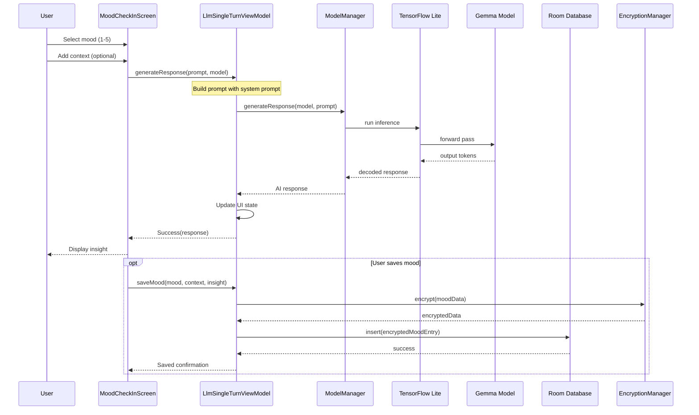

### 2. Thought Reframing Flow

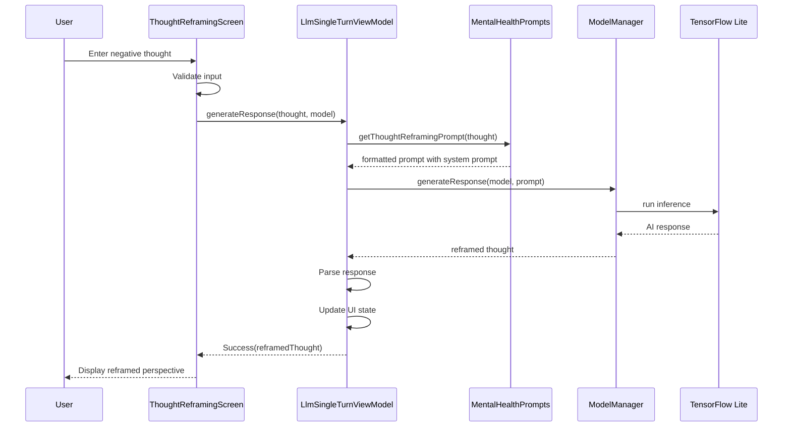

### 3. Safe Companion Chat Flow

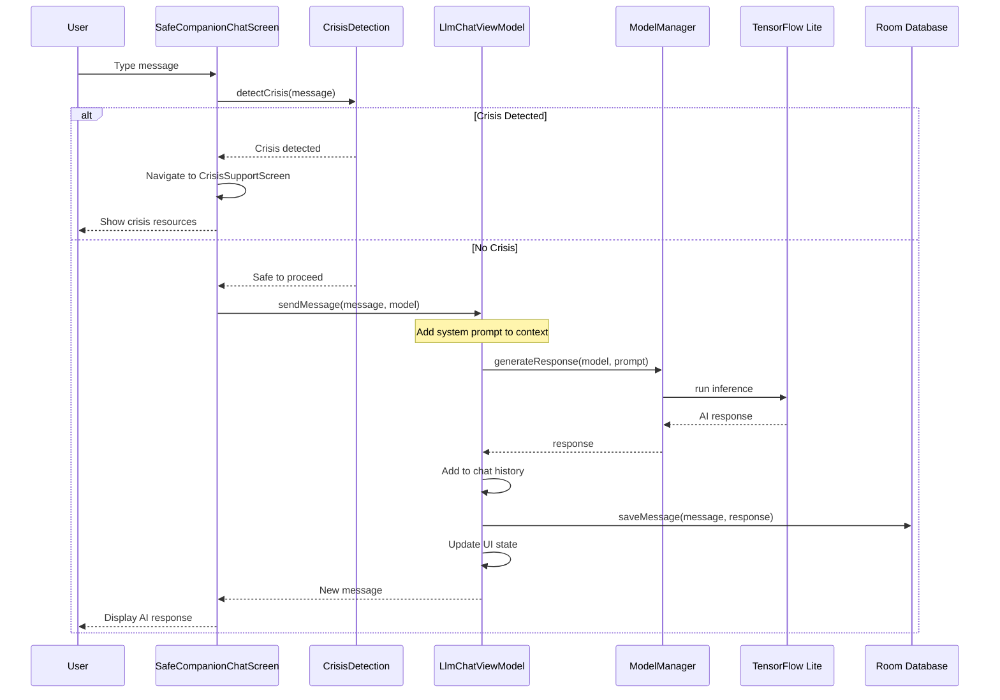

### 4. Journal Tools Flow

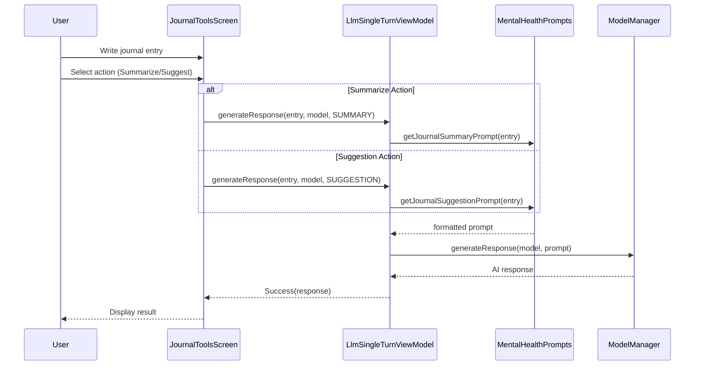

## Model Management Flow

### Model Download and Initialization

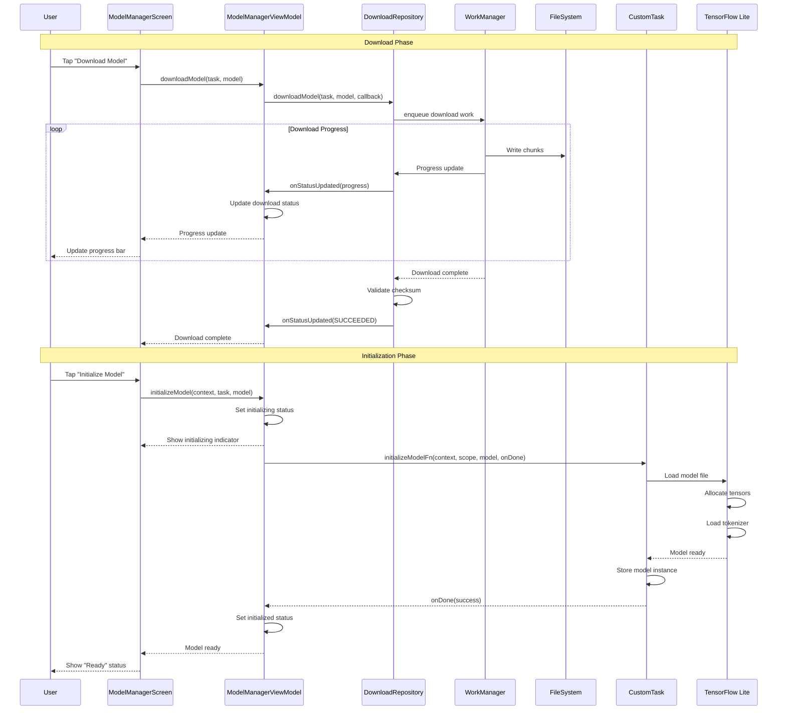

### Model Cleanup Flow

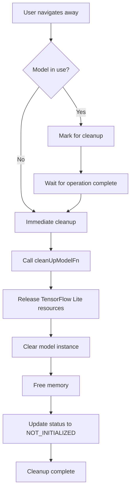

## Security and Encryption Flow

### Data Encryption Flow

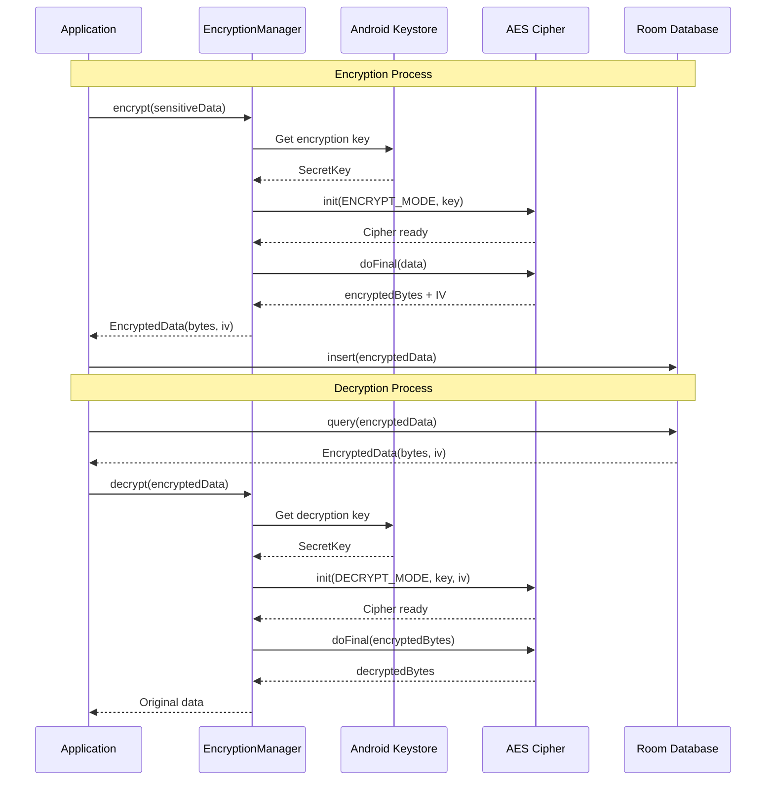

### Privacy Data Flow

```
User Data Input
       ↓
[Input Validation]
       ↓
[Sanitization]
       ↓
[Encryption with AES-256-GCM]
       ↓
[Store in Room Database]
       ↓
[Internal App Storage]
       ↓
[Android App Sandbox]
       ↓
[Device Storage]

NO NETWORK TRANSMISSION
NO CLOUD BACKUP
NO EXTERNAL ACCESS
```

## Crisis Detection Flow

### Crisis Detection Decision Tree

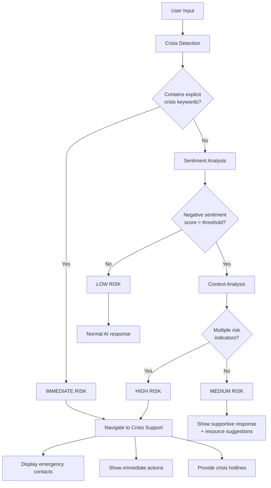

### Crisis Detection Implementation Flow

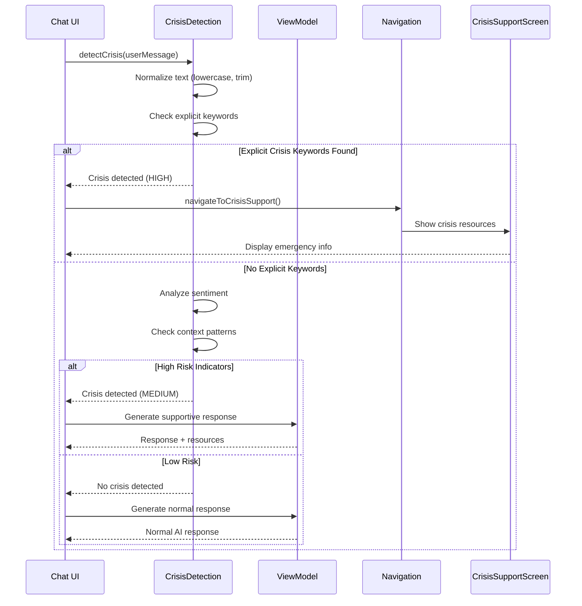

## Performance Optimization Flow

### Memory Management Flow

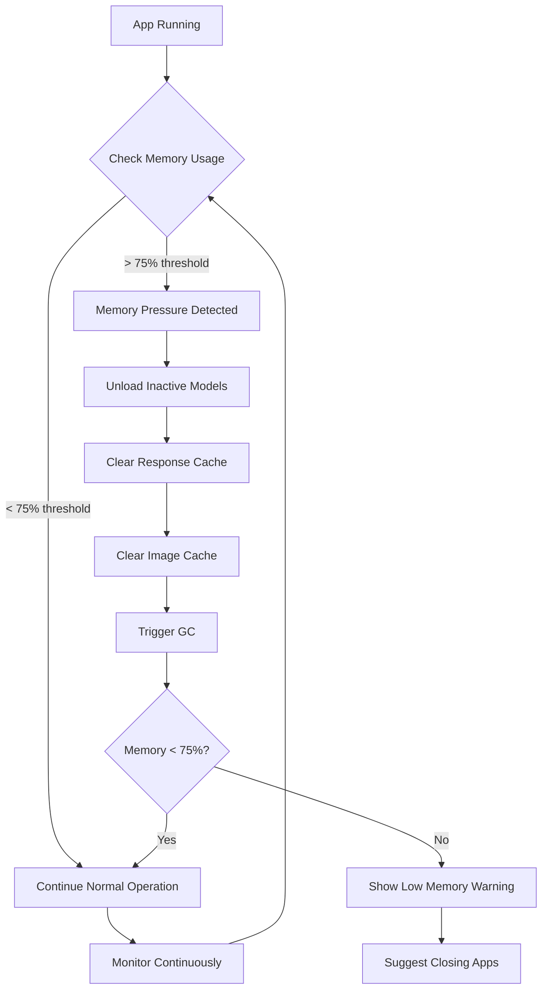

### Inference Optimization Flow

```
User Request
     ↓
[Check Model Status]
     ↓
[Model Loaded?] ──No──> [Load Model]
     ↓ Yes                    ↓
[Prepare Input]         [Initialize]
     ↓                        ↓
[Tokenize] <─────────────────┘
     ↓
[Optimize Batch Size]
     ↓
[Select Hardware Accelerator]
     ├─> GPU (if available)
     ├─> NNAPI (if supported)
     └─> CPU (fallback)
     ↓
[Run Inference]
     ↓
[Decode Output]
     ↓
[Post-process Response]
     ↓
[Return to User]
```

## Data Persistence Flow

### Room Database Operations

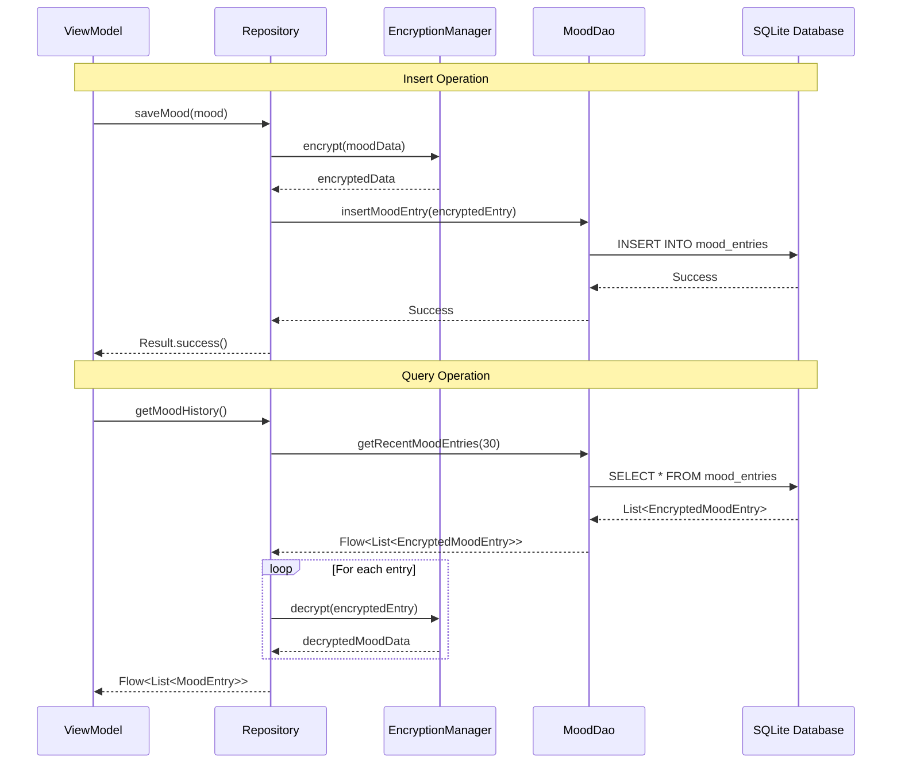

## Conclusion

This document provides comprehensive visualizations of data flow throughout the MindMate application. Key takeaways:

1. **Unidirectional Flow**: Data flows predictably through architectural layers
2. **Privacy-First**: All sensitive data encrypted before storage
3. **On-Device Processing**: No external data transmission for core features
4. **Safety Mechanisms**: Crisis detection integrated at multiple points
5. **Performance Optimization**: Efficient memory and inference management

For implementation details, refer to:
- [ARCHITECTURE.md](./ARCHITECTURE.md) for technical architecture
- [README.md](./README.md) for feature descriptions
- Source code in `Android/src/app/src/main/java/com/google/ai/edge/gallery/`

---

*Last Updated: 2025-01-XX*
